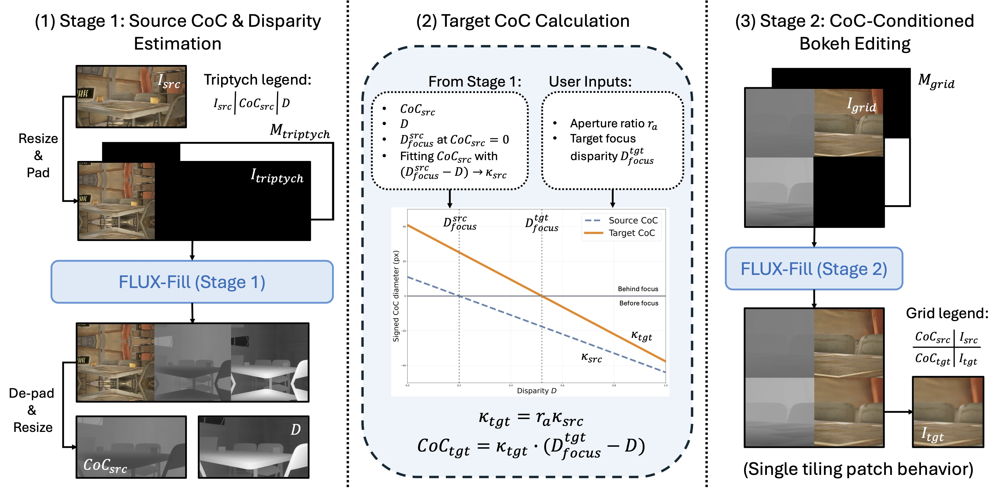

# AnyBokeh: Physics-Guided Any-to-Any Bokeh Editing with Optical Fingerprint Transfer

[Xinyu Hou](https://itsmag11.github.io/), [Xiaoming Li](https://csxmli2016.github.io/), [Zongsheng Yue](https://zsyoaoa.github.io/), [Chen Change Loy](https://www.mmlab-ntu.com/person/ccloy/)

S-Lab, Nanyang Technological University

## 🎯 Project Overview

**AnyBokeh** aims to achieve physics-grounded any-to-any bokeh editing by transforming an image from an arbitrary source optical state to a desired target focus and aperture setting through optical fingerprint transfer and dual-CoC conditioning.

