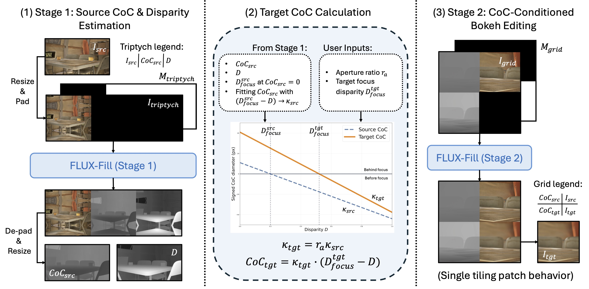

<div align="center">

# AnyBokeh: Physics-Guided Any-to-Any Bokeh Editing with Optical Fingerprint Transfer

[Xinyu Hou](https://itsmag11.github.io/), [Xiaoming Li](https://csxmli2016.github.io/), [Zongsheng Yue](https://zsyoaoa.github.io/), [Chen Change Loy](https://www.mmlab-ntu.com/person/ccloy/)

S-Lab, Nanyang Technological University

**NeurIPS 2026**

[](https://neurips.cc/)
[](https://arxiv.org/abs/2606.31959)
[](https://itsmag11.github.io/AnyBokeh/)
[](https://github.com/itsmag11/AnyBokeh)

</div>

## 🎯 Project Overview

**AnyBokeh** aims to achieve physics-grounded any-to-any bokeh editing by transforming an image from an arbitrary source optical state to a desired target focus and aperture setting through optical fingerprint transfer and dual-CoC conditioning.



## 📋 TODO

- [ ] Release inference code and pretrained checkpoints
- [ ] Release training code
- [ ] Release UnrealBokeh dataset

## 📖 Citation

If you find our work useful for your research, please consider citing:

```bibtex
@inproceedings{hou2026anybokeh,
  title     = {AnyBokeh: Physics-Guided Any-to-Any Bokeh Editing with Optical Fingerprint Transfer},
  author    = {Hou, Xinyu and Li, Xiaoming and Yue, Zongsheng and Loy, Chen Change},
  booktitle = {Advances in Neural Information Processing Systems (NeurIPS)},
  year      = {2026}
}
```
