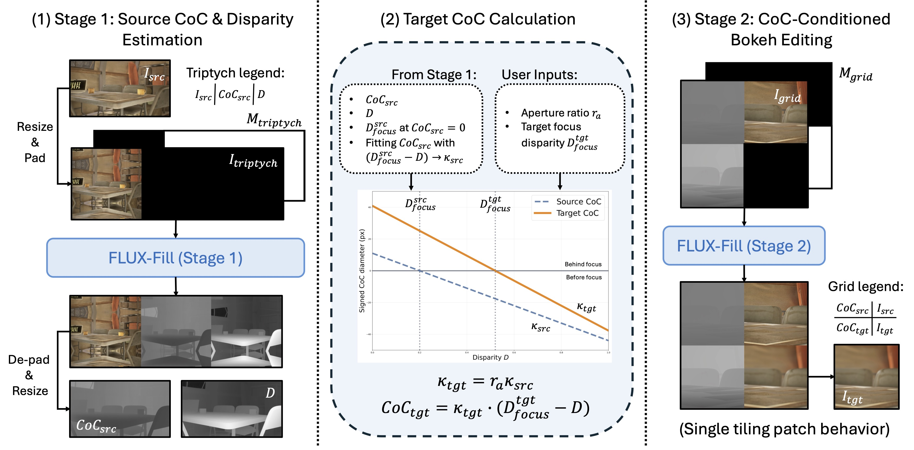

<div align="center">

# AnyBokeh: Physics-Guided Any-to-Any Bokeh Editing with Optical Fingerprint Transfer

[Xinyu Hou](https://itsmag11.github.io/), [Xiaoming Li](https://csxmli2016.github.io/), [Zongsheng Yue](https://zsyoaoa.github.io/), [Chen Change Loy](https://www.mmlab-ntu.com/person/ccloy/)

S-Lab, Nanyang Technological University

**NeurIPS 2026**

[](https://neurips.cc/)
[](https://arxiv.org/abs/2606.31959)
[](https://itsmag11.github.io/AnyBokeh/)
[](https://github.com/itsmag11/AnyBokeh)

</div>

## 🎯 Project Overview

**AnyBokeh** aims to achieve physics-grounded any-to-any bokeh editing by transforming an image from an arbitrary source optical state to a desired target focus and aperture setting through optical fingerprint transfer and dual-CoC conditioning.



## 📋 TODO

- [x] Release inference code and pretrained checkpoints
- [ ] Release training code
- [ ] Release UnrealBokeh dataset

## 🛠️ Preparation

### Environment Setup

```bash
# Create conda environment
conda create --name anybokeh python=3.10
conda activate anybokeh

# Install PyTorch (CUDA 12.4)
pip install torch==2.6.0 torchvision==0.21.0 --index-url https://download.pytorch.org/whl/cu124

# Install dependencies
pip install diffusers==0.37.0 transformers==5.3.0 peft==0.18.1 accelerate==1.13.0 huggingface_hub==1.6.0
```

### Checkpoints

AnyBokeh is built on [FLUX.1-Fill-dev](https://huggingface.co/black-forest-labs/FLUX.1-Fill-dev), which is gated: accept its license on the model page and run `hf auth login`. The base model and our [checkpoints](https://huggingface.co/itsmag11/AnyBokeh) are then downloaded automatically at the first run.

For offline use, download our checkpoints with `hf download itsmag11/AnyBokeh --local-dir checkpoints` and pass `--anybokeh_model_name_or_path checkpoints`.

## 🚀 Inference

AnyBokeh works in two stages: **Stage 1** predicts the circle-of-confusion (CoC) and disparity maps of the input image, and **Stage 2** re-renders it with a new focus point and aperture.

### End-to-End (Stage 1 + Stage 2)

Run both stages on a single image (~27 GB GPU memory):

```bash
python inference_full.py --image_path examples/127_f5.0.JPG --focus_x 904 --focus_y 613 --source_aperture 5.0 --target_aperture 2.8 --output_path outputs/127_f5.0_to_f2.8.jpg
```

For your own images:

```bash
# If you know the f-number of the input image
python inference_full.py \
    --image_path path/to/image.jpg \
    --focus_x X \
    --focus_y Y \
    --source_aperture SRC_F_NUMBER \
    --target_aperture TGT_F_NUMBER \
    --output_path path/to/output.jpg

# Otherwise, directly scale the bokeh size
python inference_full.py \
    --image_path path/to/image.jpg \
    --focus_x X \
    --focus_y Y \
    --bokeh_scale SCALE \
    --output_path path/to/output.jpg
```

- `--focus_x`, `--focus_y`: pixel coordinates of the focus point, with `(0, 0)` at the top-left corner. See [Picking the Focus Point](#picking-the-focus-point) if you are not sure which values to use.
- `--source_aperture`, `--target_aperture`: f-numbers of the input and the output.
- `--bokeh_scale`: how much to scale the bokeh size, e.g. `2.0` for twice as large and `0.5` for half. Equivalent to `source_aperture / target_aperture`.

The images in [`examples/`](examples) are named after the f-number they were shot at.

### Picking the Focus Point

If you don't know the coordinates of the point you want to focus on, run:

```bash
python focus_picker.py --image_path path/to/image.jpg
```

Then open http://127.0.0.1:8000 in your browser and click on the image to get its `--focus_x` and `--focus_y`.

### Running the Stages Separately

This is useful to reuse the Stage 1 maps for different focus points or apertures.

```bash
# Stage 1: save the CoC and disparity maps as .npy files
python inference_stage1.py \
    --image_path path/to/image.jpg \
    --coc_save_path path/to/coc.npy \
    --disp_save_path path/to/disp.npy

# Stage 2: re-render with a new focus point and aperture
python inference_stage2.py \
    --image_path path/to/image.jpg \
    --coc_path path/to/coc.npy \
    --disp_path path/to/disp.npy \
    --focus_x X \
    --focus_y Y \
    --bokeh_scale SCALE \
    --output_path path/to/output.jpg
```

## 📖 Citation

If you find our work useful for your research, please consider citing:

```bibtex
@inproceedings{hou2026anybokeh,
  title     = {AnyBokeh: Physics-Guided Any-to-Any Bokeh Editing with Optical Fingerprint Transfer},
  author    = {Hou, Xinyu and Li, Xiaoming and Yue, Zongsheng and Loy, Chen Change},
  booktitle = {Advances in Neural Information Processing Systems (NeurIPS)},
  year      = {2026}
}
```

## 📜 License

This project is licensed under the [S-Lab License 1.0](LICENSE). The pretrained weights are also subject to the [FLUX.1 [dev] Non-Commercial License](https://huggingface.co/black-forest-labs/FLUX.1-Fill-dev/blob/main/LICENSE.md).
